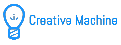

## Machine Learning to help user on creative therapy.

Have you ever heard about Creative Therapy?

Creative therapy refers to a group of techniques that are expressive
and creative in nature. The aim of creative therapies is to help
clients find a form of expression beyond words or traditional therapy,
such as cognitive or psychotherapy.

For this demo we will be simulating the activity for 3 consecutive days.
On the final app you are supposed to complete only task a day. Take it easy :)
The important part is HOW you complete the task! Not the quantity.

To test the code please run (inside creative_machine directory):
```
python3 ./hack/test_run.py
```

### Hackathon: CodeRED Curiosity - Houston, TX - October 29-30, 2016
